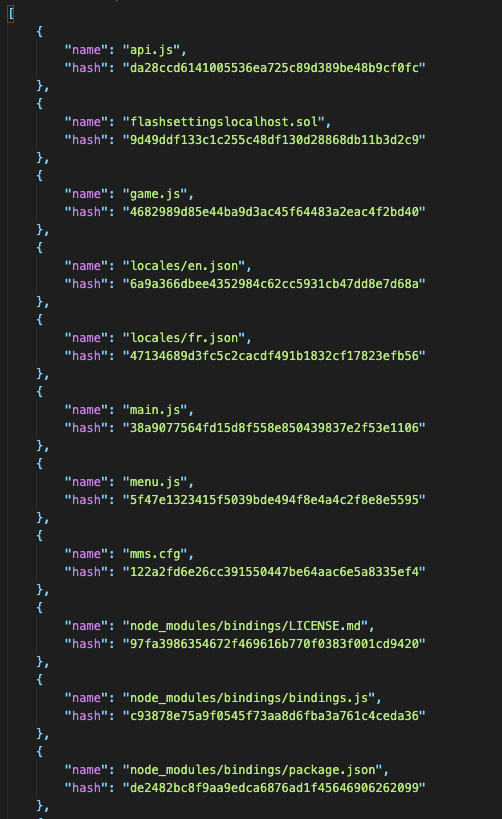

# Update Creator [](https://github.com/Conviict/UpdateCreator#readme)
> A auto update files to json list

## Examples

```
npm install
node main 1.00.12 "/Applications/yourapp/"  /yourapp/
```
- the first argument is the nme of your output file  
- the second argument is the path to the folder to be scanned  
- the third argument is the part of the path that you want to exclude from the result.  
example:  
	"/Applications/yourapp/"  /yourapp/  
We exclude everything that is before /yourapp/ including yourapp

## Output



## License

[](https://creativecommons.org/publicdomain/zero/1.0/)